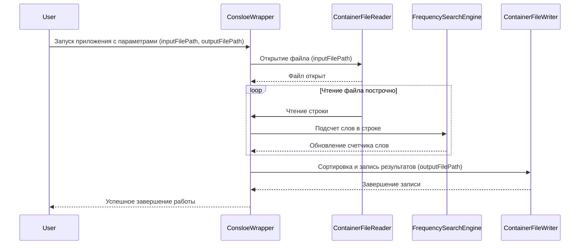

# Общее описание

Программа представляет собой консольное приложение, предназначенное для обработки текстовых файлов с целью подсчета количества вхождений слов. Основная функциональность заключается в считывании текста из указанного входного файла, анализе его содержимого и формировании результирующего файла, в котором каждое слово будет представлено вместе с количеством его появлений.

Программа принимает два параметра: имя входного файла и имя файла для записи результатов. Оба файла должны быть закодированы в формате **Windows-1251**. Слова в тексте разделяются пробелами и символами перевода строки, а их сравнение осуществляется без учета регистра, что обеспечивает корректный подсчет независимо от написания слов.

Формат результирующего файла будет следующим: каждая строка будет содержать слово и количество его вхождений в формате **«{0},{1}\n»**, где {0} — само слово, а {1} — количество его появлений.
Результаты будут отсортированы по убыванию встречаемости, что позволяет быстро идентифицировать наиболее часто используемые слова
В программе предусмотрен выход по комбинации клавиш **CTRL+C**, для принудительного завершения работы с большими файлами в режиме использования программы пользователем.

# Архитектура приложения

Приложение выполнено в виде отдельных библиотек и консольной обертки.  Отдельные библиотеки удобны как для выделения в пакеты так и для ориентации в кодовой базе.  Зависимости пакетов расставлены в соответствии с их инкапсулированием в различных слоях приложения.

Классы  пакетов внедряются друг в друга с использованием DI, что обеспечивает удобное тестирование и быструю замену функциональности.

В классах ключевой функциональности произведено разделение по бизнес логике и внешним зависимостям, для разделения ответственности и уменьшения связности кода.

Консольная обертка нужна как точка входа в приложение.
На верхнем уровне приложения использование DI не оправдано. В вернем уровне выделен статический класс **FileProcessor** для проведения диагностических тестов целого приложения. Бизнес функции он не приносит.

# Обоснование
Для обеспечения наилучшей производительности используются async и await для асинхронного чтения файла, что позволяет не блокировать поток выполнения. Использование различных классов для обработки приводит в росту потребления памяти, что оправдывает использование в программе движка основанного на разделении на массив.
Параллельная обработка обеспечивается с помощью ConcurrentDictionary и помогает обновить счетчики слов из разных потоков.
Полученную структуру счетчика слов  необходимо сконвертировать  в сортированную структуру. Такой предопределенной структуры обеспечивающей требуемую функциональность, к сожалению, не представлено в стандартный библиотеках, так что это делается через промежуточную, что вызывает дополнительное  выделение памяти.

## Точки роста

## Допущения

Для проведения диагностики работы приложения применена библиотека BenchmarkDotNet с применением анализатора аллоцированной памяти. Для более полного покрытия кодовой базы тестами - библиотека Moq
На ключевые функции применение библиотек не сказывается.
Специальный символы прилегающие к словам сичтатся частью слов.

## BanchMarks

Протокол исследования включает в себя три ключевых движка по разделению строки пришедшей из файла и записи в общий словарь, а так же учитывает выполнение с учетом работы в синхронной или асинхронной среде.
Исследование выполнялось на трех видах контента.

Расчетные движки:
1) Движок основанный на Regex
2) Движок основанный на Linq
3) Движок основанный на Array

Среда выполнения:
1) Синхронный код
2) Асинхронный код

Контент:
1) Малое количество знаков
2) Контент содержащий очень длинные строки
3) Контент содержащий очень много строк

### Engines data:

| Method           | Mean      | Error     | StdDev   | Median    | Gen0   | Allocated |
|----------------- |----------:|----------:|---------:|----------:|-------:|----------:|
| LinqSearch       |  8.542 us | 0.4644 us | 1.271 us |  8.205 us | 3.1281 |   9.63 KB |
| ArraySplitSearch |  5.883 us | 0.6147 us | 1.812 us |  4.936 us | 1.5945 |   4.89 KB |
| RegexSearch      | 27.230 us | 2.0220 us | 5.962 us | 29.016 us | 4.4556 |  13.77 KB |

### Regex data:

| Method                                 | Mean      | Error     | StdDev     | Median    | Gen0       | Gen1      | Gen2      | Allocated |
|--------------------------------------- |----------:|----------:|-----------:|----------:|-----------:|----------:|----------:|----------:|
| SmallContentAsyncProcessing            |  15.32 ms |  0.665 ms |   1.811 ms |  14.85 ms |   843.7500 |  312.5000 |         - |   3.42 MB |
| SmallContentSingleThreadProcessing     |  16.79 ms |  0.947 ms |   2.640 ms |  16.16 ms |   857.1429 |  285.7143 |         - |   3.41 MB |
| BigLenghtContentAsyncProcessing        | 438.20 ms | 37.152 ms | 108.960 ms | 392.06 ms | 11000.0000 | 7000.0000 | 2000.0000 |  55.03 MB |
| BigLenghtContentSingleThreadProcessing | 395.01 ms | 17.413 ms |  48.251 ms | 377.35 ms | 11000.0000 | 7000.0000 | 2000.0000 |  55.01 MB |
| ManyRowsContentAsyncProcessing         |  70.76 ms |  2.783 ms |   7.984 ms |  69.11 ms |  5400.0000 |  400.0000 |         - |  17.59 MB |
| ManyRowsContentSingleThreadProcessing  |  64.20 ms |  1.834 ms |   5.173 ms |  62.21 ms |  5000.0000 |  833.3333 |         - |  17.56 MB |

### Linq data:

| Method                                 | Mean       | Error     | StdDev     | Median     | Gen0       | Gen1      | Gen2      | Allocated |
|--------------------------------------- |-----------:|----------:|-----------:|-----------:|-----------:|----------:|----------:|----------:|
| SmallContentAsyncProcessing            |   7.107 ms | 0.1392 ms |  0.1810 ms |   7.104 ms |   468.7500 |   78.1250 |         - |   1.67 MB |
| SmallContentSingleThreadProcessing     |  12.061 ms | 0.2313 ms |  0.5221 ms |  11.910 ms |   843.7500 |  281.2500 |         - |   3.41 MB |
| BigLenghtContentAsyncProcessing        |  61.653 ms | 1.1790 ms |  1.5739 ms |  61.461 ms |  2750.0000 | 1375.0000 |  500.0000 |  16.42 MB |
| BigLenghtContentSingleThreadProcessing | 329.037 ms | 6.5491 ms | 14.0977 ms | 327.638 ms | 11000.0000 | 7000.0000 | 2000.0000 |  55.01 MB |
| ManyRowsContentAsyncProcessing         |  54.932 ms | 1.8581 ms |  5.0551 ms |  53.435 ms |  3636.3636 |   90.9091 |         - |  11.16 MB |
| ManyRowsContentSingleThreadProcessing  |  62.128 ms | 1.2359 ms |  2.7386 ms |  62.292 ms |  5000.0000 |  750.0000 |         - |  17.56 MB |

### Array data:
| Method                                 | Mean      | Error     | StdDev    | Median     | Gen0       | Gen1      | Gen2      | Allocated   |
|--------------------------------------- |----------:|----------:|----------:|-----------:|-----------:|----------:|----------:|------------:|
| SmallContentAsyncProcessing            |  10.03 ms |  0.235 ms |  0.648 ms |   9.970 ms |   171.8750 |   31.2500 |         - |   657.55 KB |
| SmallContentSingleThreadProcessing     |  12.67 ms |  0.227 ms |  0.201 ms |  12.636 ms |   859.3750 |  281.2500 |         - |   3495.3 KB |
| BigLenghtContentAsyncProcessing        | 156.25 ms |  3.820 ms | 10.648 ms | 152.892 ms |  1000.0000 |  333.3333 |         - |   9860.1 KB |
| BigLenghtContentSingleThreadProcessing | 385.41 ms | 14.962 ms | 41.210 ms | 377.130 ms | 11000.0000 | 7000.0000 | 2000.0000 | 56332.83 KB |
| ManyRowsContentAsyncProcessing         |  43.95 ms |  1.092 ms |  3.150 ms |  43.487 ms |   800.0000 |  100.0000 |         - |  2946.02 KB |
| ManyRowsContentSingleThreadProcessing  |  65.49 ms |  2.394 ms |  6.712 ms |  63.311 ms |  5000.0000 |  833.3333 |         - | 17984.09 KB |

## Диаграмма работы приложения

